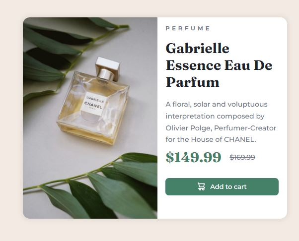
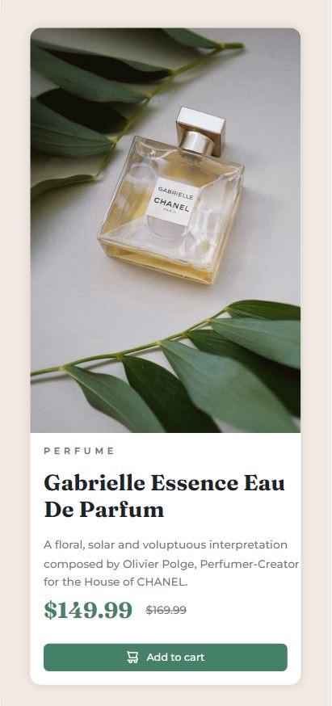

# Perfume-site
Perfume Showcase is a simple application that displays a responsive view of a product, which in this case is a perfume, along with its price. 
The main goal of this small project was to practice using ReactJS components: splitting the page into smaller parts and reusing components.

## Technologies Used
 - ReactJS
 - JavaScript
 - CSS
 - HTML
 - Yarn + Vite

## Installation

 - Clone the repository: `git clone https://github.com/aldona-krukowska/Perfume-site.git`
 - Navigate to the project directory: `cd Perfume site`
 - Install dependencies: `yarn`
 - Run the application: `yarn dev`

## Usage
Open the `http://localhost:5173` in your web browser.
The perfume view will be displayed, showing the product image, name, and price.
Adjust the browser window or open the application on different devices to experience the responsive design.

Feel free to modify and customize the code and let me know where I can improve.
